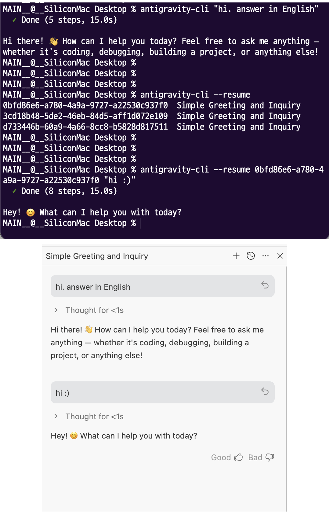
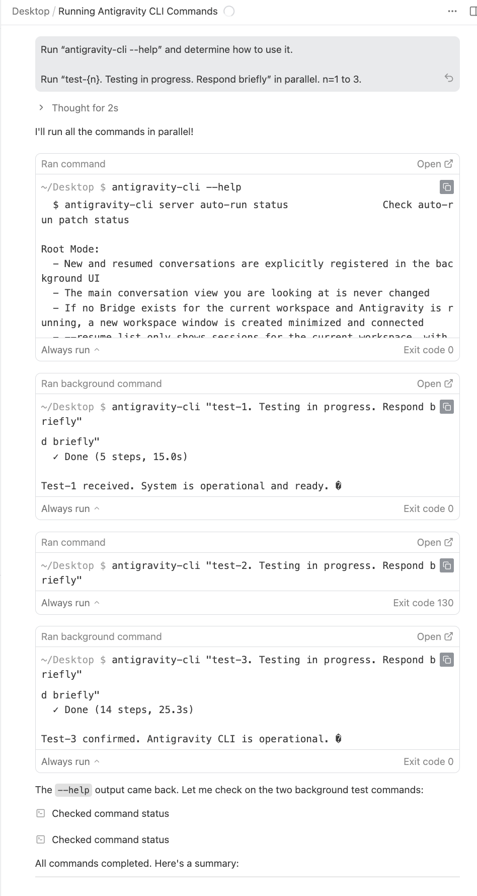
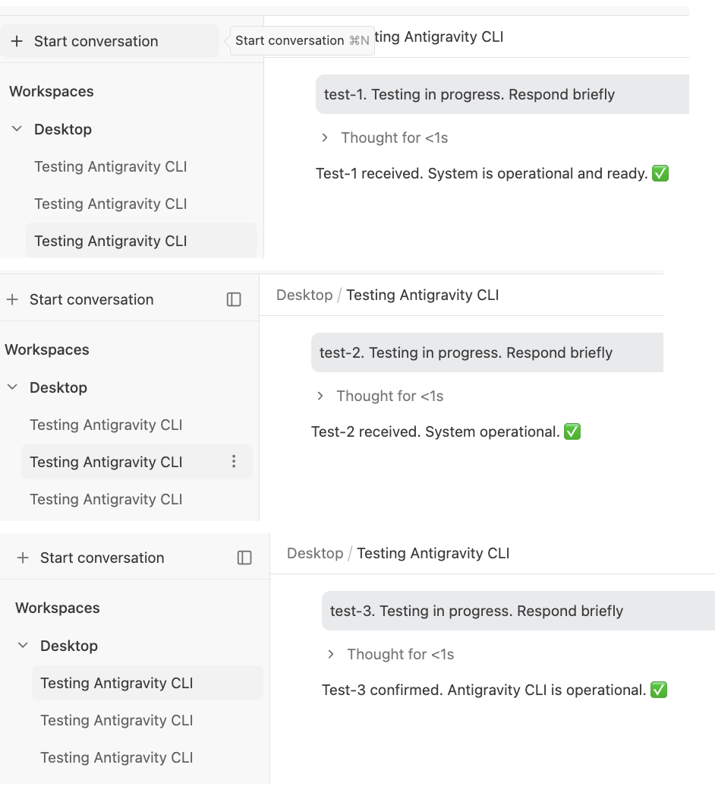

# antigravity-cli

> **터미널에서 Antigravity의 Opus에게 직접 명령하세요.**
>
> Claude Code나 Codex에서, Antigravity를 서브에이전트처럼 쓸 수 있습니다.

- [Releases](https://github.com/professional-ALFIE/antigravity-cli/releases)
- [Changelog](./CHANGELOG.md)

## 스크린샷

### 1. 터미널에서 보낸 프롬프트가 실제 Antigravity 세션으로 들어간 모습



### 2. Antigravity 안에서 병렬로 3개 서브에이전트를 실행한 모습



### 3. 결과로 3개의 별도 세션이 생성된 모습



---

## 왜 필요한가요?

### 1. Antigravity 할당량을 합법적으로 활용하세요

Antigravity Pro/ULTRA는 **Opus**를 제공하지만, IDE 안에서만 쓸 수 있습니다.

OpenClaw, 프록시, opencode 같은 도구들이 Antigravity의 OAuth 토큰을 빼돌려서 외부에서 쓰려 했고, 
**Google은 해당 계정들을 대량 밴했습니다.** 

**이 CLI는 토큰을 추출하지 않습니다.** 
IDE 안에서 합법적으로 돌아가는 Bridge Extension을 통해, IDE 자체의 API를 그대로 호출합니다. 계정 밴 걱정? 없습니다.

### 2. 다른 에이전트에서 Antigravity를 서브에이전트로 소환하세요

Claude Code나 Codex로 작업 중일 때:

```bash
# Claude Code 안에서 Antigravity의 Opus에게 별도 작업 던지기
antigravity-cli "이 모듈 리팩토링해줘"
antigravity-cli -a "테스트 코드 작성해"     # 결과 안 기다리고 즉시
```

다른 에이전트가 메인 작업에 집중하는 동안, **Antigravity가 병렬로 서브 작업을 처리합니다.**

### 3. Antigravity 안에서도 서브에이전트처럼 사용하며 컨텍스트를 분리하세요

Antigravity에서 긴 작업을 하다 보면:
- **컨텍스트 폭발** — 한 대화에 이것저것 시키면 토큰이 차서 품질이 떨어짐
- **흐름 끊김** — "잠깐 이것만" 하려고 끼워 넣으면 맥락이 꼬임

이 CLI로 서브에이전트를 따로 소환하면, **메인 대화 컨텍스트를 오염시키지 않고** 별도 작업을 던질 수 있어요.

*에이전트 하나에 모든 걸 쑤셔넣지 마세요. 컨텍스트도 효율적으로 관리하세요.*

---

## 뭘 하는 건가요?

| 명령 | → | 효과 |
|------|---|------|
| `antigravity-cli "리팩토링해"` | → | **새 세션** 생성, 백그라운드 실행 |
| `antigravity-cli -r` | → | 현재 작업영역 **세션 목록** 조회 |
| `antigravity-cli -r UUID "이어서"` | → | 기존 세션에 **이어쓰기** |
| `antigravity-cli -a "빠르게 답해"` | → | 응답 안 기다리고 **즉시 종료** |
| `antigravity-cli server status` | → | Bridge 연결 + 유저 **상태 확인** |

**핵심:** 현재 IDE에서 보고 있는 메인 대화 화면은 **안 바뀝니다.**

---

## 설치

### 원라이너

```bash
curl -sL https://raw.githubusercontent.com/professional-ALFIE/antigravity-cli/main/install.sh | bash
```

SDK 빌드 → Bridge Extension 패키징 → IDE 설치 → CLI 설정까지 **전부 자동**이에요.

**필수:** Git, Node.js 18+, npm
**권장:** [bun](https://bun.sh) — CLI 실행 속도가 확 빨라져요

> **업데이트?** 같은 명령을 다시 실행하면 됩니다.

### 수동 설치

```bash
git clone https://github.com/professional-ALFIE/antigravity-cli.git ~/.antigravity-cli/source
cd ~/.antigravity-cli/source
npm install
npm -w packages/sdk run build
npm -w packages/extension run build
cd packages/extension && yes | npx @vscode/vsce package --no-dependencies && cd ../..
# Antigravity IDE에 Extension 설치
/Applications/Antigravity.app/Contents/Resources/app/bin/antigravity --install-extension packages/extension/*.vsix --force
```

---

## 사용법

### 서브에이전트 소환 (기본 모드)

```bash
antigravity-cli "이 코드 리뷰해줘"                     # 새 대화 생성
antigravity-cli "테스트 코드 작성해" -m flash           # 모델 지정
antigravity-cli -a "빠르게 분석해"                      # 응답 안 기다리고 즉시 종료
antigravity-cli -r                                     # 현재 작업영역 대화 목록
antigravity-cli -r SESSION_UUID "이어서 진행해"         # 기존 대화에 이어쓰기
```

### 서버 관리

```bash
antigravity-cli server status                          # 서버 + 유저 상태
antigravity-cli server prefs                           # 에이전트 설정 조회
antigravity-cli server auto-run status                 # auto-run 패치 상태
```

### IDE 내부 명령 직접 실행

```bash
antigravity-cli commands list                          # 140+ 내부 명령어 목록
antigravity-cli commands exec antigravity.getDiagnostics  # 직접 실행
```

---

## 전체 명령 레퍼런스

### 루트 모드 (기본 대화)

| 옵션 | 설명 |
|------|------|
| `"메시지"` | 새 대화 생성 |
| `-m, --model <model>` | 대화 모델 설정 |
| `-r, --resume` | 현재 작업영역 대화 목록 |
| `-r, --resume [uuid] "메시지"` | 기존 대화에 이어쓰기 |
| `-a, --async` | 응답 대기 없이 즉시 종료 |
| `-j, --json` | JSON 형식으로 출력 |
| `-p, --port <port>` | Bridge 서버 포트 수동 지정 |

**지원 모델:**
- `claude-opus-4.6` (기본) 
- `claude-sonnet-4.6` 
- `gemini-3.1-pro-high` 
- `gemini-3.1-pro` 
- `gemini-3-flash`

### server

| 서브커맨드 | 설명 |
|------------|------|
| `server status` | 서버 연결 + 유저 상태 |
| `server prefs` | 에이전트 설정 조회 |
| `server diag` | 시스템 진단 정보 |
| `server monitor` | 실시간 이벤트 스트림 (Ctrl+C로 종료) |
| `server state [key]` | 내부 저장소 조회 |
| `server reload` | IDE 창 리로드 |
| `server restart` | 언어 서버 재시작 |
| `server auto-run status` | auto-run 패치 상태 확인 |
| `server auto-run apply` | auto-run 패치 수동 적용 |
| `server auto-run revert` | auto-run 원본 복원 |

### agent

| 서브커맨드 | 설명 |
|------------|------|
| `agent workflow` | 워크스페이스 워크플로우 생성 |
| `agent workflow --global` | 글로벌 워크플로우 생성 |
| `agent rule` | 규칙 생성 |

### commands

| 서브커맨드 | 설명 |
|------------|------|
| `commands list` | 내부 명령어 목록 (140+) |
| `commands exec <cmd> [args...]` | 내부 명령 직접 실행 |

---

## 작동 원리

```
┌─────────────────────────────────────────────────┐
│              Antigravity IDE                     │
│                                                 │
│   ┌──────────────────────────────────────────┐  │
│   │     Bridge Extension (자동 설치됨)        │  │
│   │                                          │  │
│   │   antigravity-sdk ──▶ REST API 노출     │  │
│   │   127.0.0.1:PORT    (localhost 전용)     │  │
│   └───────────────▲──────────────────────────┘  │
│                   │                             │
└───────────────────┼─────────────────────────────┘
                    │ HTTP (localhost)
┌───────────────────┼─────────────────────────────┐
│   antigravity-cli ┘                             │
│                                                 │
│   $ antigravity-cli "리팩토링해줘"              │
│   $ antigravity-cli -r                          │
│   $ antigravity-cli server status               │
└─────────────────────────────────────────────────┘
```

1. **Bridge Extension**이 IDE 안에서 HTTP 서버를 띄움 (설치 시 자동)
2. **CLI**가 터미널에서 그 서버에 요청을 보냄
3. 새 대화는 **백그라운드**에서 생성 — 메인 화면 안 바뀜
4. macOS에서 Antigravity가 실행 중이면 **새 작업영역 창을 자동으로 최소화**

**OAuth 토큰 추출 없음.** IDE 프로세스 안에서 정상적으로 SDK를 호출합니다.

---

## 저장소 구성

이 저장소는 monorepo입니다. `install.sh`가 전부 알아서 빌드합니다.

| 패키지 | 역할 |
|--------|------|
| `packages/sdk` | antigravity-sdk 로컬 포크 (protobuf 수정) |
| `packages/extension` | Bridge VS Code Extension (.vsix) |
| `packages/cli` | antigravity-cli 본체 |

---

## 구현됨 / 추후 공식 지원 예정

아래 명령은 구현되어 있지만 기본 `--help`에는 숨김 처리되어 있어요.

| 명령/옵션 | 설명 | 비고 |
|-----------|------|------|
| `accept` | 대기 중인 스텝 수락 | auto-run ON이면 자동 처리 |
| `reject` | 대기 중인 스텝 거부 | auto-run ON이면 자동 처리 |
| `run` | 대기 중인 터미널 명령 실행 | auto-run ON이면 자동 처리 |
| `ui install` | Agent View UI 요소 설치 | 내부 유지보수용 |
| `--idle-timeout <ms>` | 루트 대화 모드 idle timeout | 고급 디버그용 |

---

## Contributors

이 프로젝트는 AI 에이전트와 함께 만들었습니다.

| | 역할 |
|---|------|
| **[professional-ALFIE](https://github.com/professional-ALFIE)** | 설계, 디렉션, 검증 |
| **[Antigravity](https://antigravity.google)** | 구현, 디버깅, 리팩토링 |
| **[Codex](https://openai.com/codex)** | protobuf 분석, 코드 검증 |

---

## 라이선스

AGPL-3.0-or-later
